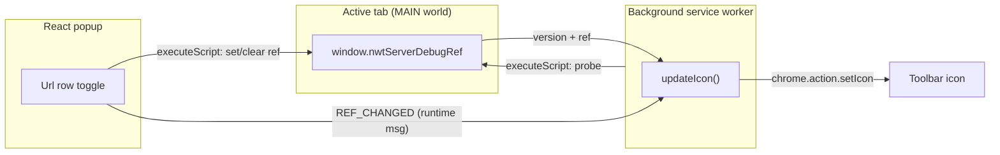

# Go Local 2

> A Nextbot developer tool (Chrome extension) for redirecting a Nextworld page's
> network and websocket traffic to a locally running server.

Go Local lets a developer point a live Nextworld app at their **local**
backend/websocket server without touching the page. You define one or more
redirect configs in the extension popup, flip one **on**, and the extension
injects that redirect into the page. The toolbar icon tells you, at a glance,
whether the current tab is a Nextworld page and whether a redirect is live.

---

## Table of contents

- [How it works](#how-it-works)
- [Toolbar icon states](#toolbar-icon-states)
- [Getting started](#getting-started)
- [Development workflow](#development-workflow)
- [Project structure](#project-structure)
- [Architecture](#architecture)
- [Page integration contract (`nwtServerDebugRef`)](#page-integration-contract-nwtserverdebugref)
- [Permissions](#permissions)
- [Conventions](#conventions)
- [Gotchas](#gotchas)

---

## How it works

The extension never guesses whether a tab is a Nextworld page from its URL —
customer environments can live on any domain. The **only** source of truth is a
global the client puts on the page: `window.nwtServerDebugRef`.

1. On every tab activation / navigation, the **background service worker**
   injects a tiny probe (`chrome.scripting.executeScript`, `world: 'MAIN'`) into
   the page to check for `window.nwtServerDebugRef` and read its current state.
2. The probe reports a **version** (`V1` or `V2`) and, for V2, the current ref.
   From that the extension derives a status: `DISABLED`, `READY`, or `LIVE`.
3. The status drives the **toolbar icon**.
4. When you toggle a redirect in the popup, the extension injects a call to
   `nwtServerDebugRef` to set/clear the ref on the page, then updates the icon.



**V1 vs V2.** Newer pages (`V2`) expose `set(ref)` / `get()`, so the live ref is
queried directly from the page. Older pages (`V1`) only expose `on(port, url)` /
`off()` with no way to read state back, so the extension remembers the V1 live
state per-tab in `chrome.storage.session`.

## Toolbar icon states

| State      | Meaning                                                            |
| ---------- | ----------------------------------------------------------------- |
| `DISABLED` | No `nwtServerDebugRef` on the page — not a Nextworld page.         |
| `READY`    | Nextworld page detected, no redirect active. Safe to go local.    |
| `LIVE`     | A redirect is currently active on the page.                       |

V1 pages additionally get a small **`V1`** badge; an active V2 redirect gets a
green badge dot.

---

## Getting started

### Prerequisites

- **Node.js** ≥ 18 (developed on current LTS/latest; no `engines` pin)
- **npm**
- **Google Chrome** (or any Chromium browser that supports Manifest V3)

### Install

```bash
npm install
```

### Build

```bash
npm run build      # one-off build into dist/
npm start          # webpack --watch: rebuilds dist/ on every change
```

The build output goes to `dist/` (cleaned on each build). That folder is the
loadable, unpacked extension.

### Load it in Chrome

1. Go to `chrome://extensions`.
2. Enable **Developer mode** (top-right).
3. Click **Load unpacked** and select the `dist/` folder.
4. Pin **Go Local 2** to the toolbar.

---

## Development workflow

Run `npm start` and keep it going — webpack watches `src/` and rebuilds `dist/`.
After a rebuild:

- **Code change (popup or background):** click the **reload** ↻ icon on the
  Go Local 2 card at `chrome://extensions`. For background-only changes you can
  also reload the service worker from that card.
- **Popup UI change:** just reopen the popup (after the extension reload).
- **`manifest.json` / permission change:** Chrome will re-prompt and may
  **disable the extension until you re-approve** the new permissions. Expected —
  re-enable it on the card.

There is no hot-reload; unpacked extensions require a manual reload after each
rebuild.

### Formatting

Prettier is configured (`.prettierrc.json`: no semicolons, single quotes,
2-space tabs, trailing commas). Format before committing:

```bash
npx prettier --write "src/**/*.{js,jsx,scss}"
```

Import ordering follows a strict 4-group convention — see
[`CLAUDE.md`](./CLAUDE.md).

---

## Project structure

```
src/
├── manifest.json            # MV3 manifest (permissions, background, action)
├── background/
│   └── background.js         # Service worker: tab listeners → updateIcon
├── popup/
│   ├── popup.js              # React entry (createRoot)
│   ├── index.html            # Popup HTML shell
│   ├── root.scss             # Global styles + icon @font-face
│   └── app/
│       ├── App.jsx           # Root component, page-stack navigation
│       ├── header/           # Title bar
│       ├── footer/           # Nav controls (add / back / config)
│       ├── main/             # URL list + per-URL editor
│       │   └── urls/url/urlconfig/
│       ├── config/           # Config page (theme + storage controls)
│       └── ref/              # RefContext (live-ref React context)
├── scripts/                  # chrome.* API wrappers (see Architecture)
├── models/                   # Data models (Model, UrlModel, RefModel, ConfigModel)
├── utils/storage/            # chrome.storage abstraction layer
├── event/                    # EventBus + Events enum
├── theme/                    # Theme (CSS vars) + Color palette
├── modules/                  # Reusable UI (icons font, text input)
└── assets/                   # Icons, fonts (design sources excluded from build)
```

---

## Architecture

### Background service worker — [`src/background/background.js`](src/background/background.js)

Registers `chrome.tabs` listeners (`onCreated`, `onActivated`, `onUpdated`) at
the top level (required for MV3) and calls `updateIcon(tabId)` on each. It also
listens via `EventBus.onBackground(REF_CHANGED)` so the popup can ask it to
refresh the icon after a toggle. It holds **no** mutable module state — all
state is recomputed from the page/storage on each event, so it's safe across
worker eviction.

### Popup (React) — [`src/popup/`](src/popup/)

- **`App.jsx`** — renders Header / current page / Footer inside `RefProvider`.
  Navigation is a stack of page **names** mapped to components (`main`,
  `config`), not stored JSX.
- **`ref/RefContext.jsx`** — `RefProvider` exposes the active tab's live ref via
  `useLiveRef()`. It seeds from `testTabRef` on mount and updates on
  `REF_CHANGED`.
- **`main/`** — the URL list (`Urls`), each row (`Url`) with an inline editor
  (`UrlConfig`). A row shows "on" when the live ref matches its model.
- **`config/`** — theme switcher (`ThemeConfig`) and a "Clear Storage" control
  (`StorageConfig`) that clears only the saved URLs.

### chrome.* wrappers — [`src/scripts/`](src/scripts/)

| Module               | Responsibility                                                            |
| -------------------- | ------------------------------------------------------------------------- |
| `getActiveTab`       | Resolve the active tab id (no-ops if there is no active tab).             |
| `getTabVersion`      | `executeScript` probe → `{ version, ref }` (or `null`).                   |
| `testTabRef`         | Map probe result → `DISABLED` / `READY` / `LIVE` (+ V1 session lookup).   |
| `toggleDebugRefOn`   | `executeScript` to set/enable the ref on the page.                        |
| `toggleDebugRefOff`  | `executeScript` to clear/disable the ref on the page.                     |
| `toggleDebugRef`     | `turnRefOn` / `turnRefOff` — orchestrate toggle + storage + `REF_CHANGED`.|
| `updateIcon`         | `testTabRef` → choose the icon via `SetIcon`.                             |
| `SetIcon`            | `chrome.action.setIcon` / badge per state.                               |

> Functions passed to `executeScript` (`func:`) run in the page's **MAIN**
> world and must be **self-contained** — no closure over outer variables; all
> inputs go through `args`. Keep them that way.

### Storage — [`src/utils/storage/`](src/utils/storage/)

A small layered abstraction over `chrome.storage`:

- **`ChromeStorage`** — raw access to a storage area (`sync` or `session`),
  namespaced under a single `GOLOCAL_2_STORAGE` key.
- **`Storage`** — base class binding a `ChromeStorage` area + a container id;
  `getContainer` / `setContainer` / `clear` (clears only its own container).
- **`Container`** — a keyed bag of records with `get`/`set`/`remove`/`getAll`.
- **`UrlStorage`** (`sync`) — saved redirect configs.
- **`ConfigStorage`** (`sync`) — theme / app config.
- **`TabRefStorage`** (`session`) — per-tab V1 live state.

### Events — [`src/event/`](src/event/)

`EventBus` has two transports. `dispatch` always fires a DOM `CustomEvent` for
in-popup subscribers; it **also** sends a `chrome.runtime` message **only** for
events flagged as background-relevant (currently just `REF_CHANGED`). Background
events are declared via the second arg to `Events` (`isBackground()`).

### Models — [`src/models/`](src/models/)

`Model` is a `payload`-backed base (`get`/`set`/`toJson`, id helpers).
`UrlModel` is a saved config (name + net/ws protocol/domain/port). `RefModel` is
the runtime redirect (`fromUrlModel`, `toRef`, `matches`). `ConfigModel` holds
app config (theme).

---

## Page integration contract (`nwtServerDebugRef`)

The extension talks to the page exclusively through `window.nwtServerDebugRef`,
which the **client app** is responsible for exposing. Detection:

```js
window.hasOwnProperty('nwtServerDebugRef')          // present → Nextworld page
window.nwtServerDebugRef.hasOwnProperty('set')      // present → V2, else V1
```

**V2 API**

```js
window.nwtServerDebugRef.set(ref)   // apply a redirect (or null to clear)
window.nwtServerDebugRef.get()      // → current ref, or null
```

**V1 API**

```js
window.nwtServerDebugRef.on(port, url)   // apply a redirect
window.nwtServerDebugRef.off()           // clear
```

**Ref shape (V2)**

```js
{
  url,     // network protocol + domain, e.g. "http://localhost"
  port,    // network port,  e.g. "8084"
  wsUrl,   // websocket protocol + domain, e.g. "ws://localhost"
  wsPort,  // websocket port, e.g. "8084"
  on,      // boolean — whether the redirect is active
}
```

---

## Permissions

Declared in [`src/manifest.json`](src/manifest.json):

| Permission                         | Why                                                       |
| ---------------------------------- | --------------------------------------------------------- |
| `storage`                          | Persist saved URLs, theme, and per-tab V1 state.          |
| `scripting`                        | Inject the probe + the ref toggle into the page.          |
| host: `https://*/`                 | Probe any https page (Nextworld envs use any domain).     |
| host: `http://localhost/*`, `127.0.0.1` | Support locally-served Nextworld apps over http.     |

The broad host scope is intentional: there is no reliable URL pattern for a
Nextworld page, so the extension must be able to probe anywhere.

---

## Conventions

- **Imports** — 4 groups (external / aliased-internal / relative / styles &
  assets), alphabetized within a group. Full rules in [`CLAUDE.md`](./CLAUDE.md).
- **Webpack aliases** — `popup`, `event`, `icons`, `input`, `models`, `scripts`,
  `storage`, `theme`, `assets`, `config`, `ref` (see
  [`webpack.config.js`](webpack.config.js)).
- **JSX runtime** — Babel uses the **classic** runtime, so `React` must be
  imported in every `.jsx` file (JSX compiles to `React.createElement`).
- **Styles** — `*.mod.scss` are CSS Modules (imported as `* as styles`); other
  `*.scss` are global.

---

## Gotchas

- **No hot reload.** Rebuild (`npm start` watches) then reload the extension on
  `chrome://extensions`.
- **Permission changes re-prompt.** Editing `host_permissions` (or any
  permission) disables the extension until you re-approve it.
- **V1 state can go stale.** V1 pages can't report their live state, so after a
  V1 page reload the remembered "live" status may no longer match the page.
- **`executeScript` payloads must be self-contained** — functions injected into
  the page must not close over outer variables; pass everything through `args`
  (see the chrome.* wrappers section under Architecture).

---

## License

ISC © Aaron Olsen
